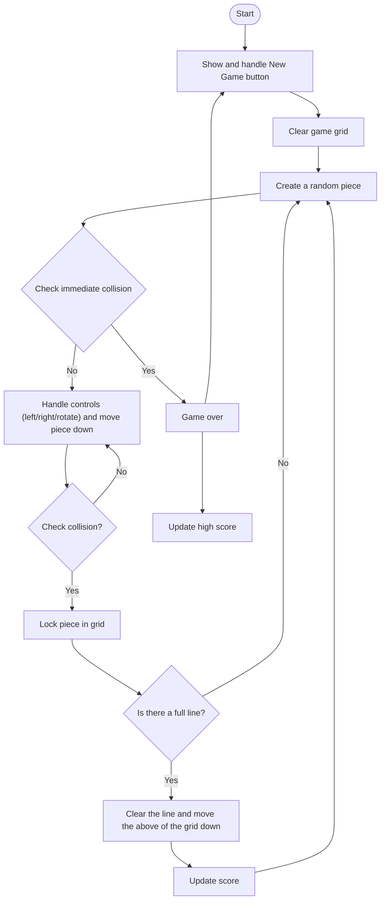

# Tetris for ESP32 (with a Cheap Yellow Display - CYD)

Couple of months ago, I stumbled upon a website called [Random Nerd Tutorials](https://randomnerdtutorials.com/), RND, of a couple who dedicated themselves for creating a nice forum for embedded development. In one of the pages I hit, they were tutoring on a display, which I was thinking to explore for some time. I had purchased several microcontrollers and led displayes in time, but they all went in my "to do" drawer and never had a good idea to do something cool.

When I saw this CYD, I said to myself "yeah, maybe I can build a game for Gunes and perhaps this is the moment that I can convert him into a geek!". I immediately [purchased one from AliExpress](https://nl.aliexpress.com/item/1005006315444628.html?spm=a2g0o.order_list.order_list_main.65.74ee79d2YPHbT2&gatewayAdapt=glo2nld). It didn't take long to understand I'll need [a case for it](https://nl.aliexpress.com/item/1005007574258198.html?spm=a2g0o.order_list.order_list_main.53.74ee79d2YPHbT2&gatewayAdapt=glo2nld), since Gunes was touching anywhere on the board, even sometimes with his wet hands!

To develop the game, I used Arduino IDE on my Mac, which was relatively easier to kickstart than I thought. I just had to download a library for ESP32 dev boards, also for the TFT screen. Instructions are copied from RND website to here, but don't forget to pay a visit to their website.

For clarity, the hardware version of the CYD I have is ESP32-2432S028R. It has a 2.8-inch TFT touchscreen, a microSD card interface and some I/O ports. 

To install the libraries, open Arduino IDE, go to Sketch > Include Library > Manage Libraries, search for TFT_eSPI and select the TFT_eSPI library from Bodmer, then install.

From the same menu, search for XPT2046_Touchscreen and find the one from Paul Stoffregen. Thanks to these guys for making it possible for us to work with these boards. The world keeps spinning on the shoulders of these amazing people! 

Then you need to replace the User_Setup.h file, which is full of a lot of definitions being referred during the compilation. Why do we need this? I don't know specifically for which definitions but I'll have to trust RND tutors. I'll put a copy in the repo for future needs. It should go under TFT_eSPI libraries, which resides at /Users/{username}/Documents/Arduino/libraries/TFT_eSPI in my system.

So, this is it for preparations, and good luck getting ready with ESP32 development!

# Some explanation on the code

My game grid is composed of a 20x10 matrice, oriented vertically. Each unit represents one square in a [tetromino](https://en.wikipedia.org/wiki/Tetromino) (a graphical shape made up of 4 squares connected orthagonally. 

In tetris, you've 7 possible one-sided tetrominos; an I, J, L, O, S, T or Z. Naturally, a tetromino can be at most 4 units wide, or tall, so any tetromino will be able to fit and can be rotated in a 4x4 matrice. So I created a const array to keep my tetrominos, and a struct to hold the current piece moving down on the screen.

```
const uint8_t TETROMINOES[7][4][4] = {
    // I
    {
        {0, 0, 0, 0},
        {1, 1, 1, 1},
        {0, 0, 0, 0},
        {0, 0, 0, 0}},

    .
    .
    .


typedef struct
{
  uint8_t shape[4][4]; // 4x4 matrix
  int posX;            // X position on grid
  int posY;            // Y position on grid
  uint16_t color;      // Color for this piece
} Tetromino;

Tetromino currentPiece = {
    {{0, 0, 0, 0},
     {0, 0, 0, 0},
     {0, 0, 0, 0},
     {0, 0, 0, 0}},
    0,      // starting X position
    0,      // starting Y position
    TFT_RED // color
};
```

Game flow is something like this:


